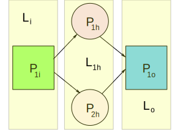

# Machine Learning with Neural Networks

## Perceptrons

The basic unit of work in a neural network is the `perceptron`. A `perceptron` has an associated potential to emit a signal. For convenience the value of the potential is kept between $0$ and $1$. If the potential $p = 1$ the neuron is active, if $p = 0$ the neuron is inactive. We can implement the `perceptron` as a function $P$ with an array of `activation values` $[a_{1}, a_{2}, a_{3}, ..., a_{n}]$ i.e. $a_{1...n}$  in it's internal scope. The function parameters are an array of `weight values` $[w_{1}, w_{2}, w_{3}, ..., w_{n}]$ or $w_{1...n}$. The output then is the signal $p$. The values $a_{1...n}$ and $w_{1...n}$ are defined as tensors because the types of operations or functions that will be used to manipulate the `perceptrons` comes from a branch of mathematics called [Tensor Analysis](https://en.wikipedia.org/wiki/Tensor_calculus). Consider the implementation of $P$ based on the following:

* We define tensors $\hat{A} = a_{1...n}$ and $\hat{W} = w_{1...n}$.
* Multiply tensors $\hat{A}$ and $\hat{W}$ i.e. $\hat{C} = \hat{A} \cdot \hat{W}$.
* The tensor product will be $\hat{C} = [a_{1}w_{1}, a_{2}w_{2}, a_{3}w_{3}, ..., a_{n}w_{n}]$.
* Reduce $\hat{C}$ to a scalar value by adding it's components.
* The sum of the $\hat{C}$ components is $S_{w} = a_{1}w_{1} + a_{2}w_{2} + a_{3}w_{3}, ..., a_{n-1}w_{n-1} + a_{n}w_{n}$.
* ${S_{w}}$ is called a weighted sum  and is represented by $\sum_{n=1}^{k} a_{n}w_{n}$ where $k$ is the number of elements in $\hat{C}$.
* $S_{w}$ determines the strength of the signal emitted by the `perceptron`.
* Capping $S_{w}$ adds additional control over signal emission and is done by subtracting a bias $b$ from the sum.
* It is possible for $S_{w} - b$ to have a value outside the desire signal strength $0 \geq p \leq 1$. For this reason an `activation function` is used to bring $p$ into the desired range.
* One of the  commonly used `activation functions` is the `sigmoid` $\sigma (x) =  \frac {\mathrm{1} }{\mathrm{1} + e^{-x} }$.
* In conclusion $P(\hat{W}) = \sigma (S_{w} - b)$.

## Neural Networks

A `neural network` is a graph of associated `perceptrons`. `Neural networks` are composed of `neural network layers`. A `neural network layer` is a tensor of `perceptrons`. The `perceptrons` in a `neural network layer` are connected to each other because they are components of a tensor. We can define layer n as $\hat{L}_{n} = [P_{1}, P_{2}, P_{3}, ... ,P_{n}]$. Neural networks have three `layer types input, hidden, and output`. A neural network  may have multiple hidden layers but only one input and output layers. Consider a neural network consisting of the fallowing layers:

$\hat{L}_{i} = [P_{1i}]$ &nbsp;&nbsp; $\hat{L}_{1h} = [P_{1h},P_{2h}]$ &nbsp;&nbsp; $\hat{L}_{o} = [P_{1o}]$

Neural network themselves are tensors. In this case neural network $\hat{N} = [\hat{L}_{i}, \hat{L}_{1h}, \hat{L}_{o} ]$. `Perceptrons` in a neural network are associated to each other via `function composition`. Consider $P_{1i}$ it has an internal tensor of `activation values` $\hat{A}_{i1} = [a_{1i}]$. The number of components in $\hat{A}_{i1}$ is one. The output of $P_{1i}$ is a potential $p_{1i}$. The key question one must ask at this point is, how are the number of `activation values` in $\hat{L}_{1h}$ associated to the number of `activation values` in $\hat{L}_{i}$? Here is where the magic happens $p_{1i}$ becomes the input weight for $P_{1h}$ and $P_{2h}$. This means that $p_{1i}$ becomes $\hat{W}_{1i} = [p_{1i}]$ a weight value tensor and the input for $P_{1h}$ and $P_{2h}$. This means that the activation values tensor for $P_{1h}$ is $\hat{A}_{h1} = [a_{1h}]$ a tensor with one component because the input layer consist of only one component $P_{1i}$. Is important to notice that `the number of activation values in a layer's perceptrons are determined by the number of perceptrons in the previous layer`.

For completeness let's consider the output layer `perceptron` $P_{1o}$. Based on our current understanding $P_{1o}$ has an internal tensor of `activation values` $\hat{A}_{o1} = [a_{1o}, a_{2o}]$ because $\hat{L}_{1h}$ has two components $P_{1h}$ and $P_{2h}$. The output for $P_{1h}$ is a potential $p_{1h}$ and the output for $P_{2h}$ is a potential $p_{2h}$ therefore the weight value tensor is $\hat{W}_{1h} = [p_{1h}, p_{2h}]$. The weighted sum for $P_{1o}$ is $S_{w1o} = p_{1h}a_{1o} + p_{2h}a_{2o}$ and its potential is $p_{1o} = \sigma(S_{w1o} - b)$. At this point the manner in which every perceptron in a neural network layer has an effect on all other perceptrons in the network should be clear.

## Neural Network Activation

### Introduction

At this point think of a neural network as a system defined by the following tensor $\hat{N} = [\hat{L}_{i}, \hat{L}_{1h}, \hat{L}_{2h}, \hat{L}_{3h},...\hat{L}_{nh}, \hat{L}_{o} ]$.
Systems have `state`, in our daily experience we go through time and we have `a state at each moment in time`. Our reality is a series of moments in time. At each moment we can `assess our state` and map any number of metrics to an exact moment in time and persist the resulting information representing our `state`. Compare to you or me $\hat{N}$ is a very simple system, a moment of time for it is represented by evaluating $\hat{L}_{1h}, \hat{L}_{2h}, \hat{L}_{3h},...\hat{L}_{nh}$ and $\hat{L}_{o}$ at a given value of $\hat{L}_{o}$. We bring $\hat{N}$ to life by feeding it `input` and evaluating the `output` of every `perceptron` $P$ in each neural network layer $\hat{L}$.

### Back Propagation

### Error Function

### Gradient Descent